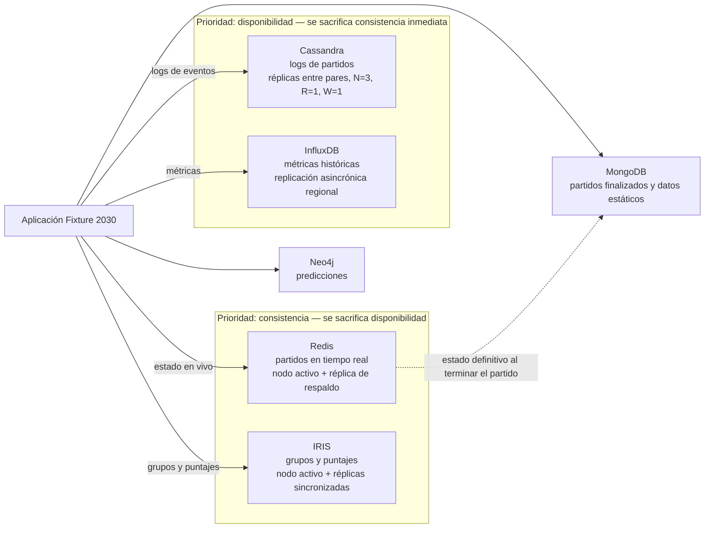

# Hito 3 — Arquitectura distribuida (Fixture 2030)

Grupo 16 · Ingeniería de Datos II

## 1. Síntesis de decisiones previas

A partir del análisis de los hitos anteriores se definió una arquitectura de persistencia políglota. Las decisiones vigentes del Hito 2 son:

| Necesidad de datos | Tecnología | Responsabilidad principal |
| :--- | :--- | :--- |
| Logs generados durante los partidos | Cassandra | Registrar el alto volumen de información que generan los encuentros |
| Partidos y valores en tiempo real | Redis | Mantener el estado vigente de los partidos con baja latencia |
| Partidos finalizados y datos estáticos | MongoDB | Guardar partidos finalizados, jugadores, selecciones y estadios |
| Grupos y puntajes | IRIS | Mantener composición de grupos, puntajes y posiciones de forma consistente |
| Predicciones de usuarios | Neo4j | Representar las relaciones entre usuarios, partidos y pronósticos |
| Métricas y estadísticas históricas | InfluxDB | Guardar información temporal y analizar su evolución |

El escenario exige operar en varias regiones, atender entre 2 y 3 millones de usuarios simultáneos, superar las 100.000 solicitudes por segundo en alta demanda, mantener una latencia menor a 100 ms para el 95 % de las consultas críticas y alcanzar una disponibilidad de 99,99 %.

Para profundizar el análisis distribuido se priorizan cuatro subsistemas con necesidades distintas: logs de partidos (Cassandra), partidos en tiempo real (Redis), grupos y puntajes (IRIS) y métricas históricas (InfluxDB). MongoDB y Neo4j siguen en la arquitectura, pero no se analizan con el mismo nivel de detalle.

## 2. Análisis CAP y modelos de consistencia

Con varias regiones, la red puede partirse. Ante una partición no se pueden garantizar a la vez consistencia y disponibilidad: cada subsistema tiene que elegir una de las dos (la tolerancia a la partición se asume), y decir qué sacrifica y qué impacto acepta.

| Subsistema | Propiedad que se prioriza | Propiedad que se sacrifica | Modelo de consistencia | Impacto aceptado |
| :--- | :--- | :--- | :--- | :--- |
| Logs de partidos (Cassandra) | Disponibilidad | Consistencia inmediata | Consistencia eventual | La generación de logs no se detiene. Se acepta que las réplicas difieran un tiempo, mientras después queden iguales. |
| Partidos en tiempo real (Redis) | Consistencia | Disponibilidad | Consistencia fuerte | Un marcador o evento no debe mostrarse distinto según desde dónde se mire. Durante una partición, el lado que no puede confirmar el estado más reciente deja de responder o limita las operaciones sobre ese partido, en lugar de mostrar un dato que después se contradiga. |
| Grupos y puntajes (IRIS) | Consistencia | Disponibilidad | Consistencia fuerte | Los integrantes de un grupo tienen que ver los mismos puntajes, posiciones y composición. Durante una partición se pueden limitar altas, cambios y actualizaciones en la región aislada. |
| Métricas históricas (InfluxDB) | Disponibilidad | Consistencia inmediata | Consistencia eventual | Un retraso breve en llegar una métrica es aceptable si permite seguir recibiendo datos sin cortes. |

La versión anterior asignaba a Redis consistencia y disponibilidad a la vez, lo que no es posible ante una partición. Se corrige: Redis prioriza consistencia y sacrifica disponibilidad.

## 3. Replicación y quórum

La replicación busca que el servicio siga si se pierde un nodo. La estrategia depende del acceso de cada subsistema.

| Subsistema | Replicación y topología | Costo aceptado |
| :--- | :--- | :--- |
| Logs de partidos (Cassandra) | Varias réplicas entre pares, repartidas entre regiones | Favorece escrituras continuas y tolerancia a fallos, a cambio de lecturas que pueden ser levemente antiguas |
| Partidos en tiempo real (Redis) | Un nodo activo con una réplica de respaldo | Permite recuperar el servicio ante una falla; un partido de mucha audiencia puede concentrar el tráfico en el mismo nodo |
| Grupos y puntajes (IRIS) | Un nodo activo con réplicas sincronizadas | Acerca los grupos a sus usuarios y mantiene copias para recuperación; una región muy activa puede concentrar más carga |
| Métricas históricas (InfluxDB) | Replicación asincrónica entre nodos regionales | Se sigue recibiendo información aunque una réplica se retrase; se acepta una diferencia temporal entre copias |

Para Cassandra se propone un factor de replicación N=3 con lectura y escritura en R=1 y W=1. Cada operación se completa con la respuesta de un solo nodo, lo que favorece la baja latencia y la disponibilidad. Como R + W ≤ N, no se garantiza consistencia fuerte y se mantiene la consistencia eventual definida. El costo es que una lectura puede caer en una réplica que todavía no recibió la última escritura. Para los demás subsistemas no se aplican parámetros N, R y W de forma explícita: sus garantías se expresan en las estrategias de replicación y consistencia de la tabla anterior.

## 4. Escalabilidad, fallos y métricas

La arquitectura debe absorber picos de más de 100.000 solicitudes por segundo y entre 2 y 3 millones de usuarios simultáneos, con latencia menor a 100 ms para el 95 % de las consultas críticas. El crecimiento se plantea sobre todo agregando nodos. El aumento de capacidad de un único servidor sirve como mejora puntual, pero no alcanza frente a un crecimiento sostenido.

Los componentes más sensibles durante un partido son Redis, por la concentración de consultas sobre el estado en vivo, y Cassandra e InfluxDB, por el aumento de escrituras. IRIS se ve más afectado por las actualizaciones de puntajes y las consultas de grupos.

### Escenarios de falla y su relación con CAP

| Escenario | Respuesta esperada | Propiedad que rige |
| :--- | :--- | :--- |
| Caída de un nodo | Las réplicas disponibles siguen atendiendo. En Redis o IRIS una réplica asume el rol activo; Cassandra sigue con los demás nodos. | — |
| Partición de red entre regiones | **Cassandra e InfluxDB** siguen operando en los dos lados y se sincronizan al reunirse (se prioriza disponibilidad; se sacrifica consistencia inmediata). **Redis e IRIS** limitan o rechazan las operaciones en el lado que no puede confirmar el estado más reciente (se prioriza consistencia; se sacrifica disponibilidad). | Disponibilidad en Cassandra e InfluxDB; consistencia en Redis e IRIS |
| Falla de una región | Cassandra e InfluxDB mantienen el servicio con sincronización posterior. Redis e IRIS evitan estados contradictorios y pueden limitar operaciones hasta que una réplica quede como activa. | Igual que arriba |
| Saturación en un partido popular | Se reparte la carga con más capacidad horizontal. Se vigila el nodo del partido de mayor audiencia. | — |
| Retraso entre réplicas | En logs y métricas se tolera mientras las copias converjan. En partidos en vivo y puntajes no se debe responder con una réplica desactualizada si puede mostrar información contradictoria. | Consistencia en Redis e IRIS |

### Métricas de control

- **Disponibilidad:** porcentaje de solicitudes atendidas correctamente (objetivo 99,99 %). En Redis e IRIS conviene medir además cuántas operaciones se rechazaron por una partición, porque es el costo que se aceptó.
- **Latencia:** tiempo de respuesta y percentil 95 (objetivo menor a 100 ms en consultas críticas).
- **Operaciones por segundo:** lecturas y escrituras, sobre todo durante los picos.
- **Utilización:** uso de CPU, memoria y almacenamiento por nodo.
- **Estado de las réplicas:** réplicas disponibles, retraso de sincronización y nodos fuera de servicio.
- **Distribución de carga:** operaciones por nodo, para detectar nodos sobrecargados.

## 5. Diagrama y decisiones pendientes

El diagrama muestra, junto con la replicación de cada subsistema, qué propiedad de CAP rige ante una partición, para mantener la relación entre el análisis CAP, la replicación y el comportamiento esperado.

En una partición, los subsistemas del bloque superior siguen respondiendo y reconcilian después; los del bloque inferior limitan operaciones para no mostrar estados contradictorios.

Quedan pendientes de validación en los próximos hitos:

- Comprobar si la distribución de carga evita nodos sobrecargados en partidos de mucha audiencia.
- Validar que la cantidad de réplicas alcance ante la caída de un nodo o de una región.
- Determinar cómo y con qué frecuencia el estado definitivo de un partido pasa de Redis a MongoDB.
- Comprobar con pruebas de carga que se mantiene la latencia objetivo y se soportan los picos.
- Revisar el crecimiento de los logs y las métricas para definir cuánto tiempo conservarlos.
- Verificar que las decisiones de consistencia y replicación respondan como se espera ante fallos reales.

Estas validaciones permiten ajustar la arquitectura antes de implementarla, con los objetivos de disponibilidad de 99,99 %, baja latencia y capacidad de operar ante fallos parciales sin comprometer los datos críticos.
